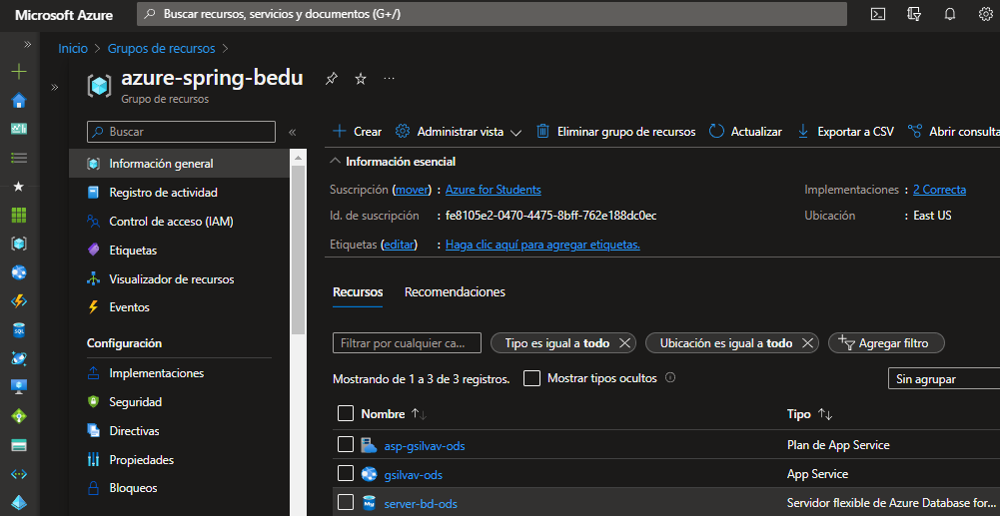

# Proyecto ODS
## Entrega del proyecto final del módulo 3 de HSBC TechAcademy 

Video de entrega del Checkpoint Módulo 3:
<https://youtu.be/ltHeORMr0Lw>

Video de Módulo 2:
<https://youtu.be/ebKH3DjXDGg>

**API REST  en la nube :**
```
http://gsilvav.servehttp.com:8084/auth/signin	POST	

Ingreso a la API con token JWT.
```

```
/api/usuarios/registro	POST

Agrega un nuevo usuario (no requiere autorización)
{
    "usuario": "bedu",
    "correo": "bedu@bedu.org",
    "password": "12345678",
    "rePassword": "12345678",
    "alias": "beduhsbc",
    "rol": "USER"
}

```
Objetivo
- Creación de una API REST con Spring Boot
- Uso de Spring MVC para implementar el patrón Modelo Vista Controlador
- Conexión a base de datos usando los repositorios de Spring Data Jpa
- Log4j2 y configuracion de logs en formato JSON 
- Servicio de mensajería de colas usando JMS para la comunicación entre dos sistemas.
- Uso de herramientas como Lombok y MapStruct.
- Manejo de servicios REST que usan el  protocolo HTTP
- HATEOAS para enlaces Hypermedia
- Validaciones a los  atributos de las   clases que  representan el   modelo de negocio
- Manejador de   excepciones   global para  errores de   validaciones y   para errores  generales de la   aplicación
- manejador de errores que  aproveche los códigos definidos en HTTP
- Seguridad  a los servicios de la  API usando Spring  Security
- pruebas unitarias de componentes  específicos de la  aplicación  utilizando JUnit
- Automatizar el   proceso de testing  utilizando el   Selenium (pendiente)
- Configuración del POM para conectar con servidor IBM Open Liberty




**API ODS**

Usuarios

```
/api/usuarios[?nombre=string]	GET	

Buscar todos los usuarios registrados, el parámetro nombre busca por el nombre de un usuario en particular.
```
```
/api/usuarios	POST

Agrega un nuevo usuario
```
```
/api/usuarios/{id}	PUT	

Actualiza la información del usuario.
```
```
/api/usuarios/{id}	DELETE	

Elimina un usuario.
```
Proyectos

```
/api/proyectos [?nombre=string]	GET	

Buscar todos los proyectos registrados, el parámetro nombre busca por el nombre de un proyecto en particular.
```
```
/api/proyectos	POST	

Agrega un nuevo proyecto
```
```
/api/proyectos /{id}	PUT	

Actualiza la información del proyecto.
```
```
/api/proyectos/{id}	DELETE	

Elimina un usuario.
```

Tareas
```
/api/tareas/proyecto/{proyectoId}/usuario/{usuarioId}	GET	

Buscar las tareas que estén asignadas a un proyecto y a un usuario en particular.
```
```
/api/tareas/proyecto/{proyectoId}/usuario/{usuarioId}	POST	

Agrega una nueva tarea asignada a un proyecto y a un usuario en particular.
```
```
/api/tareas /{id}	PUT
Actualiza la información de la tarea
```

```
/api/tareas /{id}	DELETE
Elimina una tarea	
```
```
Logs	Recurso
/api/logs	GET	
Muestra las excepciones CRUD que se generaron al realizar la consulta con la api REST
```

Sub/Pub JMS
```
/api/sendQueue	GET	
El publicador (usuario registrado) envía al ActiveMQ una cola y se entrega a un consumidor (administrador)
```

```
/api/sendTopic	GET	
El publicador (proyecto finalizado) envía al ActiveMQ un tema y se entrega a varios consumidores (equipo de trabajo)
```
